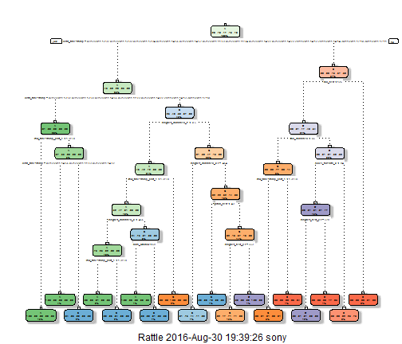

```
# Final Project Report - Practical Machine Learning Course
```
## Nimesh Sinha
## Aug 30, 2016

# Background Introduction
It is the final assignment given in Coursera's course 'Practical Machine Learning' from Johns Hopkins University.
"Using devices such as Jawbone Up, Nike FuelBand, and Fitbit it is now possible to collect a large amount of data about personal activity relatively inexpensively. These type of devices are part of the quantified self movement ??? a group of enthusiasts who take measurements about themselves regularly to improve their health, to find patterns in their behavior, or because they are tech geeks. One thing that people regularly do is quantify how much of a particular activity they do, but they rarely quantify how well they do it. In this project, your goal will be to use data from accelerometers on the belt, forearm, arm, and dumbell of 6 participants. They were asked to perform barbell lifts correctly and incorrectly in 5 different ways. More information is available from the website here: [dataset](http://groupware.les.inf.puc-rio.br/har) (see the section on the Weight Lifting Exercise Dataset)."

# Data Sources
The training data for this project are available here:

[traindata](https://d396qusza40orc.cloudfront.net/predmachlearn/pml-training.csv)

The test data are available here:

[testdata](https://d396qusza40orc.cloudfront.net/predmachlearn/pml-testing.csv)

The data for this project comes from this original source: [source](http://groupware.les.inf.puc-rio.br/har).

Please Note that the data can be loaded directly from the URL provided without downloading the file to personal environment. But the code can be customized for specific needs.

# Project Intended Results
The goal of the project is to predict the manner in which they did the exercise. This is the "classe" variable in the training set. One may use any of the other variables to predict with. One should create a report describing how to built the model, how to use cross validation, what sample error may be, and what is the reson behind the choices made. One would use ones prediction model to predict 20 different test cases.

# Submission requirement
* A link to a Github repo with R markdown and compiled HTML file describing the analysis. 
* The text of the writeup should be < 2000 words and the number of figures should be less than 5.

# Reproduceablity
In order to reproduce the same results, we need a certain set of packages, as well as setting a pseudo random seed.

The following set of libraries were used for this project.

```r
library(caret)
library(rpart)
library(rpart.plot)
library(RColorBrewer)
library(rattle)
library(randomForest)
```
Finally, the seed is loaded with the following line of code:

```r
set.seed(12345)
```
# Getting the data

```r
trainUrl <- "http://d396qusza40orc.cloudfront.net/predmachlearn/pml-training.csv"
testUrl <- "http://d396qusza40orc.cloudfront.net/predmachlearn/pml-testing.csv"
training <- read.csv(url(trainUrl), na.strings=c("NA","#DIV/0!",""))
testing <- read.csv(url(testUrl), na.strings=c("NA","#DIV/0!",""))
```
# Partioning the training set into two
Partioning Training data set into two data sets, 60% for myTraining, 40% for myTesting:

```r
inTrain <- createDataPartition(y=training$classe, p=0.6, list=FALSE)
myTraining <- training[inTrain, ]; myTesting <- training[-inTrain, ]
dim(myTraining); dim(myTesting)
```

```
## [1] 11776   160
```

```
## [1] 7846  160
```
# Cleaning the data
The following transformations were used to clean the data:

Transformation 1: Cleaning NearZeroVariance Variables and view possible NZV Variables:

```r
myDataNZV <- nearZeroVar(myTraining, saveMetrics=TRUE)
```
To create another subset without NZV variables:

```r
myNZVvars <- names(myTraining) %in% c("new_window", "kurtosis_roll_belt", "kurtosis_picth_belt",
"kurtosis_yaw_belt", "skewness_roll_belt", "skewness_roll_belt.1", "skewness_yaw_belt",
"max_yaw_belt", "min_yaw_belt", "amplitude_yaw_belt", "avg_roll_arm", "stddev_roll_arm",
"var_roll_arm", "avg_pitch_arm", "stddev_pitch_arm", "var_pitch_arm", "avg_yaw_arm",
"stddev_yaw_arm", "var_yaw_arm", "kurtosis_roll_arm", "kurtosis_picth_arm",
"kurtosis_yaw_arm", "skewness_roll_arm", "skewness_pitch_arm", "skewness_yaw_arm",
"max_roll_arm", "min_roll_arm", "min_pitch_arm", "amplitude_roll_arm", "amplitude_pitch_arm",
"kurtosis_roll_dumbbell", "kurtosis_picth_dumbbell", "kurtosis_yaw_dumbbell", "skewness_roll_dumbbell",
"skewness_pitch_dumbbell", "skewness_yaw_dumbbell", "max_yaw_dumbbell", "min_yaw_dumbbell",
"amplitude_yaw_dumbbell", "kurtosis_roll_forearm", "kurtosis_picth_forearm", "kurtosis_yaw_forearm",
"skewness_roll_forearm", "skewness_pitch_forearm", "skewness_yaw_forearm", "max_roll_forearm",
"max_yaw_forearm", "min_roll_forearm", "min_yaw_forearm", "amplitude_roll_forearm",
"amplitude_yaw_forearm", "avg_roll_forearm", "stddev_roll_forearm", "var_roll_forearm",
"avg_pitch_forearm", "stddev_pitch_forearm", "var_pitch_forearm", "avg_yaw_forearm",
"stddev_yaw_forearm", "var_yaw_forearm")
myTraining <- myTraining[!myNZVvars]
dim(myTraining)
```

```
## [1] 11776   100
```
Transformation 2: Killing first column of Dataset - ID. Removing first ID variable so that it does not interfer with ML Algorithms:

```r
myTraining <- myTraining[c(-1)]
```
Transformation 3: Cleaning Variables with too many NAs.I'm going to leave  the variables that have more than a 60% threshold of NA's :

```r
trainingV3 <- myTraining #creating another subset to iterate in loop
for(i in 1:length(myTraining)) { #for every column in the training dataset
        if( sum( is.na( myTraining[, i] ) ) /nrow(myTraining) >= .6 ) { #if n?? NAs > 60% of total observations
        for(j in 1:length(trainingV3)) {
            if( length( grep(names(myTraining[i]), names(trainingV3)[j]) ) ==1)  { #if the columns are the same:
                trainingV3 <- trainingV3[ , -j] #Remove that column
            }   
        } 
    }
}
#To check the new N?? of observations
dim(trainingV3)
```

```
## [1] 11776    58
```

```r
#Seting back to our set:
myTraining <- trainingV3
rm(trainingV3)
```
Same 3 transformations for myTesting and testing data sets.

```r
clean1 <- colnames(myTraining)
clean2 <- colnames(myTraining[, -58]) #already with classe column removed
myTesting <- myTesting[clean1]
testing <- testing[clean2]

#To check the new N?? of observations
dim(myTesting)
```

```
## [1] 7846   58
```

```r
#To check the new N?? of observations
dim(testing)
```

```
## [1] 20 57
```

In order to ensure proper functioning of Decision Trees and especially RandomForest Algorithm with the Test data set (data set provided), we need to coerce the data into the same type.

```r
for (i in 1:length(testing) ) {
        for(j in 1:length(myTraining)) {
        if( length( grep(names(myTraining[i]), names(testing)[j]) ) ==1)  {
            class(testing[j]) <- class(myTraining[i])
        }      
    }      
}
#To make sure Coertion really worked:
testing <- rbind(myTraining[2, -58] , testing) #note row 2 does not mean anything, this will be removed right.. now:
testing <- testing[-1,]
```
# Using ML algorithms for prediction: Decision Tree

```r
modFitA1 <- rpart(classe ~ ., data=myTraining, method="class")
```
Note: to view the decision tree with fancy run this command:

```r
fancyRpartPlot(modFitA1)
```


Predicting:

```r
predictionsA1 <- predict(modFitA1, myTesting, type = "class")
```
Using confusion Matrix to test results:

```r
confusionMatrix(predictionsA1, myTesting$classe)
```

```
## Error in requireNamespaceQuietStop("e1071"): package e1071 is required
```
# Using ML algorithms for prediction: Random Forests

```r
modFitB1 <- randomForest(classe ~. , data=myTraining)
```
Predicting in-sample error:

```r
predictionsB1 <- predict(modFitB1, myTesting, type = "class")
```
Using confusion Matrix to test results:

```r
confusionMatrix(predictionsB1, myTesting$classe)
```

```
## Error in requireNamespaceQuietStop("e1071"): package e1071 is required
```
Random Forests yielded better Results, as expected!

# Generating Files to submit answers for the Assignment:
Finally, using the provided Test Set out-of-sample error.

For Random Forests we use the following formula, which yielded a much better prediction in in-sample:

```r
predictionsB2 <- predict(modFitB1, testing, type = "class")
```
Function to generate files with predictions to submit for assignment

```r
pml_write_files = function(x){
  n = length(x)
  for(i in 1:n){
    filename = paste0("problem_id_",i,".txt")
    write.table(x[i],file=filename,quote=FALSE,row.names=FALSE,col.names=FALSE)
  }
}

pml_write_files(predictionsB2)
```
